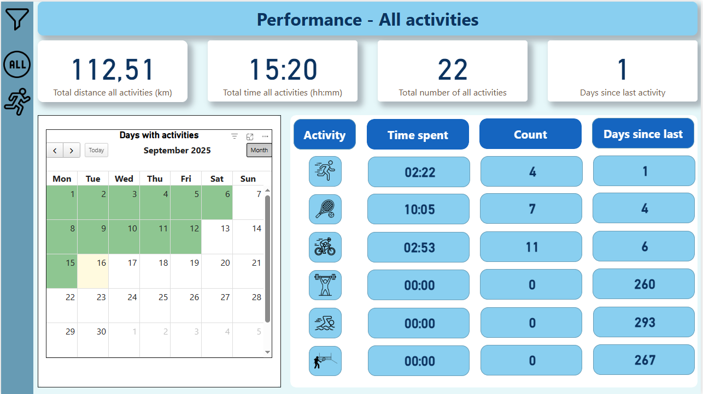
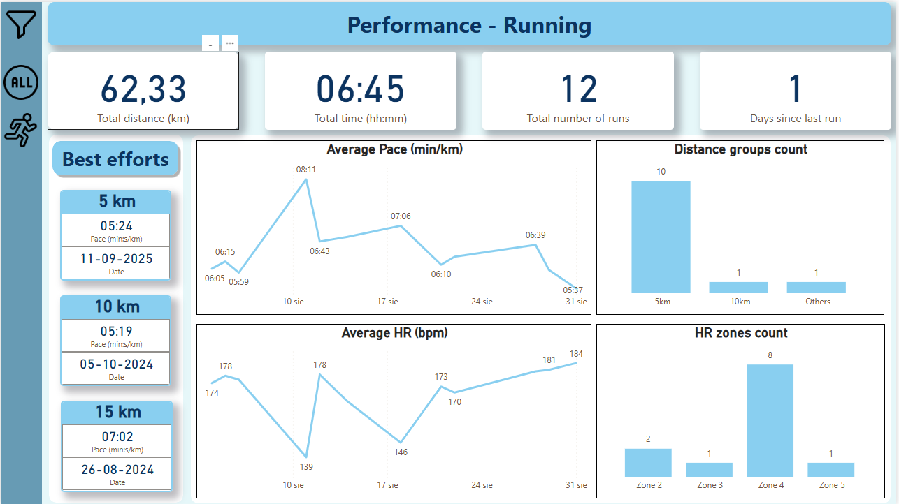
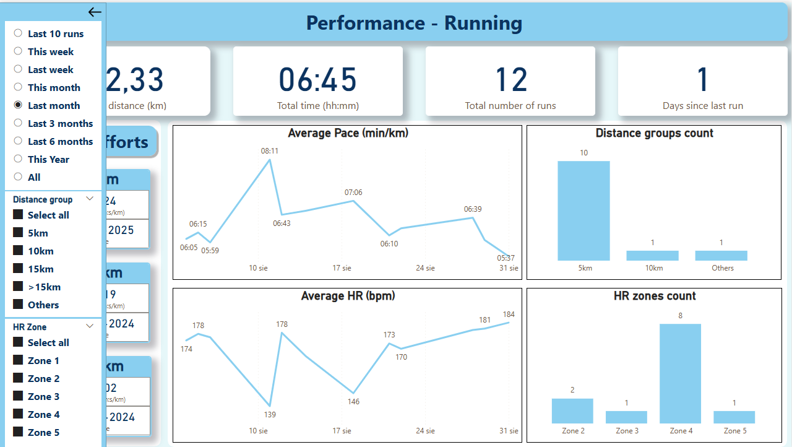

# StravaBI – Personal Sports Performance Dashboard

This project is a **Power BI dashboard** for analyzing sports activities exported from **Strava**.  
It provides detailed insights into training sessions, performance metrics, and progress over time.  

The dashboard is fully interactive, allowing filtering by time ranges, activity types, distance groups, and heart rate zones.  
It was created to help track training habits, monitor effort, and identify trends in performance.

---

## 📑 Table of Contents
- [🎯 Goals](#-goals)
- [🗂️ Data Model](#%EF%B8%8F-data-model)
- [🚀 Features](#-features)
- [📊 Dashboard Preview](#-dashboard-preview)
- [📐 Example DAX Measures](#-example-dax-measures)
- [🛠️ Technologies](#%EF%B8%8F-technologies)
- [📂 Project Structure](#-project-structure)
- [⚙️ Setup](#%EF%B8%8F-setup)

---

## 🎯 Goals

- Provide a **comprehensive view of training activity** beyond what Strava offers natively.
- Support **data-driven insights** for training optimization.
- Demonstrate the use of **Power BI, Power Query (M), DAX, and Python** for personal analytics projects.

---

## 🗂️ Data Model

The dashboard uses a **star schema** to organize Strava activities and support flexible filtering:

- **Fact table**  
  - `strava_activities_detailed_final` – detailed activity log from the Strava API (distances, times, pace, HR, etc.)

- **Dimension tables**  
  - `dates` – calendar table for time intelligence  
  - `sport_type` – mapping `sportID` to activity categories (running, cycling, swimming, tennis, etc.)  
  - `DistanceGroups` – grouping of running distances (5k, 10k, 15k, >15k, others)  
  - `HRZoneTable` – mapping average heart rate values into zones (Zone 1–5)  
  - `TimeFilterTable` – defines custom time filters (last 10 runs, this week, last month, etc.) for the side panel  


---

## 🚀 Features

- **Overall performance overview**
  - Total distance, training time, and number of activities
  - Days since last activity
  - Calendar view with days containing activities
  - Breakdown of sports disciplines (running, cycling, swimming, tennis, gym, etc.)

- **Running performance dashboard**
  - Best efforts (5 km, 10 km, 15 km)
  - Average pace progression
  - Distance group distribution
  - Heart rate zone analysis

- **Interactive filters**
  - Time ranges (last 10 runs, this week, last month, last 3/6 months, this year, all)
  - Distance groups (5 km, 10 km, 15 km, >15 km, others)
  - Heart rate zones (Zone 1–5)

---

## 📊 Dashboard Preview

### 1. All Activities Overview


---

### 2. Running Performance


---

### 3. Side Panel with Filters


---

## 📐 Example DAX Measures

### Best pace date
Returns the date of the activity with the best pace, formatted as dd-MM-yyyy. Used in card visuals to display best efforts.

<details>
<summary>Show code</summary>

```DAX
Best Pace Date = 
CALCULATE(
    FORMAT(
        MAX('strava_activities_detailed_final'[start_date]),
        "dd-MM-yyyy"
    ),
    TOPN(
        1,
        'strava_activities_detailed_final',
        'strava_activities_detailed_final'[Best Pace (s/km)], ASC
    )
)
```
</details>


### Time mask  
Defines a dynamic time filter (last 10 runs, this week, last month, last 3/6 months, this year, all). It is applied to the custom side panel filters that control the dashboard view.

<details>
<summary>Show code</summary>

```DAX
Time Mask = 
VAR _sel = SELECTEDVALUE(TimeFilterTable[FilterID], 9)
VAR _axisDate = MAX('strava_activities_detailed_final'[start_date])

VAR _today = TODAY()

-- day of week (Monday=1)
VAR _dow = WEEKDAY(_today, 2)
VAR _sow = _today - (_dow - 1)   -- start of week (Monday)
VAR _eow = _sow + 6              -- end of week (Sunday)

-- month boundaries
VAR _thisMoStart = DATE(YEAR(_today), MONTH(_today), 1)
VAR _thisMoEnd   = EOMONTH(_today, 0)

-- without the current month
VAR _prevMoStart = DATE(YEAR(EDATE(_today, -1)), MONTH(EDATE(_today, -1)), 1)
VAR _prevMoEnd   = EOMONTH(_today, -1)

VAR _last3Start = DATE(YEAR(EDATE(_today, -3)), MONTH(EDATE(_today, -3)), 1)
VAR _last3End   = EOMONTH(_today, -1)

VAR _last6Start = DATE(YEAR(EDATE(_today, -6)), MONTH(EDATE(_today, -6)), 1)
VAR _last6End   = EOMONTH(_today, -1)

-- year
VAR _thisYearStart = DATE(YEAR(_today), 1, 1)

RETURN
SWITCH(
    _sel,
    1, -- Last 10 runs
            IF(
        RANKX(
            FILTER(ALL('strava_activities_detailed_final'), 'strava_activities_detailed_final'[sportID] = 3),
            CALCULATE(MAX('strava_activities_detailed_final'[start_date])),
            ,
            DESC
        ) <= 10,
        1,
        0),

    2, IF(_axisDate >= _sow && _axisDate <= _eow, 1, 0),                 -- This week
    3, IF(_axisDate >= _sow-7 && _axisDate <= _sow-1, 1, 0),             -- Last week
    4, IF(_axisDate >= _thisMoStart && _axisDate <= _thisMoEnd, 1, 0),   -- This month
    5, IF(_axisDate >= _prevMoStart && _axisDate <= _prevMoEnd, 1, 0),   -- Last month
    6, IF(_axisDate >= _last3Start && _axisDate <= _last3End, 1, 0),     -- Last 3 months
    7, IF(_axisDate >= _last6Start && _axisDate <= _last6End, 1, 0),     -- Last 6 months
    8, IF(_axisDate >= _thisYearStart && _axisDate <= _today, 1, 0),     -- This year
    9, 1                                                                 -- All
)

```
</details>

### Time spent Run (hh:mm)  
Calculates the total running time (sportID = 3) within the selected Time Mask period and formats it as hh:mm.

<details>
<summary>Show code</summary>

```DAX
Time spent Run (hh:mm) = 
VAR totTime =
    CALCULATE(
        SUM(strava_activities_detailed_final[moving_time_h]),
        FILTER(strava_activities_detailed_final,
            strava_activities_detailed_final[sportID] = 3
                && [Time Mask] = 1
        )
    )
VAR safeTotTime = COALESCE(totTime, 0)
VAR hours = INT(safeTotTime)
VAR mins = ROUND((safeTotTime - hours) * 60, 0)
RETURN FORMAT(hours, "00") & ":" & FORMAT(mins, "00")
```
</details>

---

## 🛠️ Technologies

- **Power BI Desktop** – building interactive dashboards and data model
- **Power Query (M)** – cleaning, shaping, and transforming Strava data
- **DAX** – custom measures for time intelligence, filtering, and performance metrics
- **Python** – fetching and preprocessing Strava API data
- **GitHub Actions** – CI/CD workflow for automated fetching of Strava data (`strava_fetch_detailed.py`)

---

## 📂 Project Structure

```text

StravaBI/
│
├── .github/workflows/        # GitHub Actions workflows (automated data fetch & update)
│
├── data/                     # Strava datasets and assets (auto-updated via GitHub Actions)
│   ├── strava_activities_detailed.csv
│   ├── README_images/        # Screenshots for documentation
│   ├── icons/                # Custom icons used in the dashboard visuals
│   └── custom_visual/        # External Power BI custom visual (.pbiviz) – calendar component
│
├── .env.example              # Example environment variables for Strava API credentials
├── .gitignore
│
├── dashboard.pbix            # Power BI dashboard (interactive)
├── dashboard.pdf             # Static preview for quick sharing (no Power BI required)
│
├── get_refresh_token.py      # One-time script to obtain initial refresh token
├── strava_utils.py           # Helpers for token management and API calls
├── strava_fetch_detailed.py  # Main script to download and update activities
│
├── requirements.txt          # Python dependencies for Strava API scripts
└── README.md                 # Project documentation

```

---

## ⚙️ Setup

1. Clone this repository:
   ```bash
   git clone https://github.com/m-mikolajczyk/StravaBI.git
   ```

2. Install Python dependencies:
   ```bash
   pip install -r requirements.txt
   ```

3. Configure Strava API credentials in `.env` (see `.env.example`).

4. Obtain your **initial refresh token**:
   - Follow the Strava API authentication guide: [Strava API – Authentication](https://developers.strava.com/docs/authentication/).  
   - Generate an authorization URL (`https://www.strava.com/oauth/authorize?...`) with your client ID and scopes.  
   - After authorizing the app, you will be redirected to a URL containing a `code` parameter.  
   - Use `get_refresh_token.py` with that `code` to exchange it for a refresh token.  
   - Save the refresh token in your `.env` file.

5. Run `strava_fetch_detailed.py` to download detailed activity data  
   *(or let GitHub Actions handle automatic updates of the dataset).*

6. Open `dashboard.pbix` in **Power BI Desktop**.  
   - If needed, update the data source in the main table to point to your local `data/strava_activities_detailed.csv` (or the GitHub-hosted CSV).  
   - Refresh the data model and start exploring your performance.
